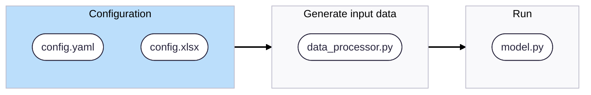

# ENLIGHT

European Network for Long-term Insights on Grid prices, Hedging & Trends

## Overview
This repository contains a multi-year market forecast model simulating electricity market clearing across all European bidding zones.  
It reproduces the market clearing algorithm by solving an optimisation problem over a user-configurable time horizon and scenario set.  

The model ingests a comprehensive, structured dataset of energy system components (generation assets, demand profiles, network topology, fuel prices, etc.) and outputs detailed market forecasts including energy balances, generation schedules, line flows, dispatched demand, and curtailment.


## Features

- Models all European bidding zones with multi-year foresight  
- Reproduces market clearing using a solver-based optimisation approach  
- Easy scenario configuration via Excel and YAML files  
- Includes base datasets to get started immediately  
- Produces detailed results for generation, demand, lineflows, and curtailment  

## Installation

1. **Clone the repository**:
   Clone the repository via SSH:
    ```bash
    https://github.com/marco-saretta/enlight.git
    ```

2. **Create a conda environment from the provided file**
   ```bash
   conda env create -f environment.yaml
   conda activate enlight-env
   ```


## Quick Start

1. **Configure your scenarios**

   - Edit the Excel file `config/scenarios_config.xlsx` to define scenario-specific inputs such as capacities, costs, and technology availability.  
   - Adjust general run parameters in `config/config.yaml` (e.g., number of bidding zones, simulation years).  

2. **Run the model**

```bash
python main.py
```

The script will load configuration and input data, execute the optimisation, and write outputs to `simulations/<scenario_name>/results/`.  

## Input Data Structure

The repository includes base datasets under the `data/` directory covering:

- Generation units (thermal, hydro, wind, solar, etc.)  
- Demand profiles (flexible and inflexible, classic and EV)  
- Network topology and lines  
- Fuel and CO₂ price projections  
- Weather and capacity projections for renewables  

Users can extend or replace these datasets to model alternative futures.

## Outputs

Model outputs are stored per scenario in:

```
simulations/<scenario_name>/results/
```

Typical outputs include:

- Unit generation schedules and capacity utilization  
- Energy balance summaries  
- Electricity prices and market clearing information  
- Line flow results across the network  
- Demand dispatch and curtailment metrics  


## Code Architecture

```
.
├── main.py                   # Entry point for running simulations
├── environment.yaml          # Conda environment specification
├── requirements.txt          # Python package dependencies
├── config/                   # Configuration files for scenarios and runs
│   ├── config.yaml
│   └── scenarios_config.xlsx
├── data/                     # Input datasets organized by technology and type
├── enlight/                  # Core Python package
│   ├── data_ops/             # Data loading and preprocessing modules
│   ├── model/                # Market optimisation model implementation
│   ├── runner/               # Simulation orchestration
│   └── utils/                # Utility functions
├── simulations/              # Output folders with scenario results
├── docs/                     # Project documentation
├── tests/                    # Unit and integration tests
└── examples/                 # Example scripts and notebooks
```

Key code locations:
- `enlight/data_ops` — data loading and preprocessing
- `enlight/model` — market/optimisation model(s)
- `enlight/runner/runner.py` — orchestration of simulation flows
- `main.py` — top-level entry point that triggers the runner

## Running Tests

Execute the test suite with:

```bash
pytest tests/
```

Add tests for new features under the `tests/` folder.


## Documentation

For detailed guidance, see the `docs/` folder, including:

- Installation instructions  
- Configuration options and scenario setup  
- User guide for running and interpreting results  
- System architecture and design details  
- API reference for developers  
- Testing and troubleshooting information  

## License

GPL-3.0 license.

## Authors & Acknowledgements

Author: Marco Saretta
Collaborators: Viktor Johnsen