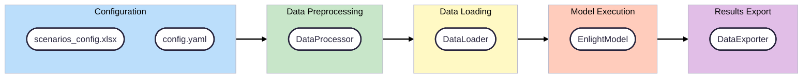

# ENLIGHT

European Network for Long-term Insights on Grid prices, Hedging & Trends

## Overview
Multi-year electricity market forecast model simulating market clearing across all European bidding zones using solver-based optimization.


```mermaid
---
config:
  theme: redux
---
flowchart LR
 subgraph s1["Configuration"]
        n2(["scenarios_config.xlsx"])
        n4(["config.yaml"])
  end
 subgraph s2["Data Preprocessing"]
        n5(["DataProcessor"])
  end
 subgraph s3["Data Loading"]
        n6(["DataLoader"])
  end
 subgraph s4["Model Execution"]
        n7(["EnlightModel"])
  end
 subgraph s5["Results Export"]
        n8(["DataExporter"])
  end
    s1 --> s2
    s2 --> s3
    s3 --> s4
    s4 --> s5
    style s1 fill:#BBDEFB,color:#000000
    style s2 fill:#C8E6C9,color:#000000
    style s3 fill:#FFF9C4,color:#000000
    style s4 fill:#FFCCBC,color:#000000
    style s5 fill:#E1BEE7,color:#000000
```

## Features

- Models all European bidding zones with multi-year foresight  
- Reproduces market clearing using optimization (Gurobi/HiGHS)  
- Easy scenario configuration via Excel and YAML
- Flexible yearly or weekly simulation modes
- Comprehensive output: prices, dispatch, flows, curtailment

## Installation

```bash
git clone https://github.com/marco-saretta/enlight.git
cd enlight
conda env create -f environment.yaml
conda activate enlight-env
```

## Quick Start

**1. Configure scenarios** in `config/scenarios_config.xlsx`  
Define technology capacities, costs, and constraints for each scenario.

**2. Set simulation parameters** in `config/config.yaml`

```yaml
scenario_list:
  - scenario_1:
      run_mode: "yearly"      # Full year optimization
      year: 2030
      plant_aggregation: false

  - scenario_2:
      run_mode: "weekly"      # Week-by-week optimization
      year: 2040
      plant_aggregation: true
      week_range:
        start_week: 10
        end_week: 20

solver_name: "gurobi"         # Options: "gurobi", "highs"
bidding_zones:                # Select zones to model
  - AT
  - DELU
  - FR
  # ...
```

**3. Run simulations**

```bash
python main.py
```

```python
# main.py
from enlight.runner import EnlightRunner
from pathlib import Path

if __name__ == "__main__":
    root_path = Path(__file__).parent.resolve()
    r = EnlightRunner(root_path=root_path)
    
    r.run_scenario('scenario_1')
    r.run_scenario('scenario_2')
```

## How It Works: The Four-Step Pipeline

Each scenario execution follows an automated pipeline:

### 1. Data Preprocessing (`DataProcessor`)
Transforms raw data into model-ready formats. Processes generation profiles, demand, network topology, and validates consistency. Saves to `simulations/<scenario_name>/data/`.

### 2. Data Loading (`DataLoader`)
Loads preprocessed data into memory as structured objects (DataFrames, arrays). Organizes by time period (yearly: 8760h, weekly: 168h). Accessible for debugging.

### 3. Model Execution (`EnlightModel`)
Solves market clearing optimization (maximize social welfare subject to power balance, generation limits, transmission capacity, storage dynamics). Outputs dispatch schedules, prices, and flows.

### 4. Results Export (`DataExporter`)
Extracts solutions, calculates metrics, saves results to `simulations/<scenario_name>/results/`. For weekly mode, combines individual weeks into annual summaries.

## Yearly vs Weekly Mode

**Yearly:** Single optimization over 8760 hours. Captures seasonal patterns and long-term storage. Higher memory requirement.

**Weekly:** Sequential optimization of individual weeks. Lower memory footprint, suitable for large systems. May not capture multi-week storage strategies.

## Output Structure

```
simulations/<scenario_name>/
├── data/                          # Preprocessed inputs
└── results/                       # Model outputs
    ├── electricity_prices.csv
    ├── generation_schedules.csv
    ├── lineflows.csv
    ├── demand_served.csv
    ├── curtailment.csv
    └── marginal_generator.csv
```

## Logging

Execution logs with timing saved to `logs/enlight.log`:

```
2024-11-24 10:30:00 - enlight - INFO - Starting: Data preprocessing
2024-11-24 10:30:05 - enlight - INFO - Completed: Data preprocessing in 5.23 seconds
2024-11-24 10:30:05 - enlight - INFO - Starting: Model execution
2024-11-24 10:45:12 - enlight - INFO - Completed: Model execution in 904.56 seconds
```

## Code Structure

```
.
├── main.py                   # Entry point
├── config/
│   ├── config.yaml           # Simulation settings
│   └── scenarios_config.xlsx # Scenario parameters
├── data/                     # Base input datasets
├── enlight/
│   ├── data_ops/             # Preprocessing, loading, export
│   ├── model/                # Optimization model
│   ├── runner/               # Pipeline orchestration
│   └── utils/                # Logging, timing, helpers
├── simulations/              # Scenario outputs
└── logs/                     # Execution logs
```

## Documentation

See `docs/` for detailed guides on configuration, architecture, API reference, and troubleshooting.

## Testing

```bash
pytest tests/
```


## Project Information

**Version:** 1.0  
**License:** GPL-3.0  
**Authors:** Marco Saretta, Viktor Johnsen  
**Repository:** [github.com/marco-saretta/enlight](https://github.com/marco-saretta/enlight)


## Citation

```bibtex
@software{enlight2024,
  author = {Saretta, Marco and Johnsen, Viktor},
  title = {ENLIGHT: European Network for Long-term Insights on Grid prices, Hedging \& Trends},
  year = {2024},
  url = {https://github.com/marco-saretta/enlight}
}
```